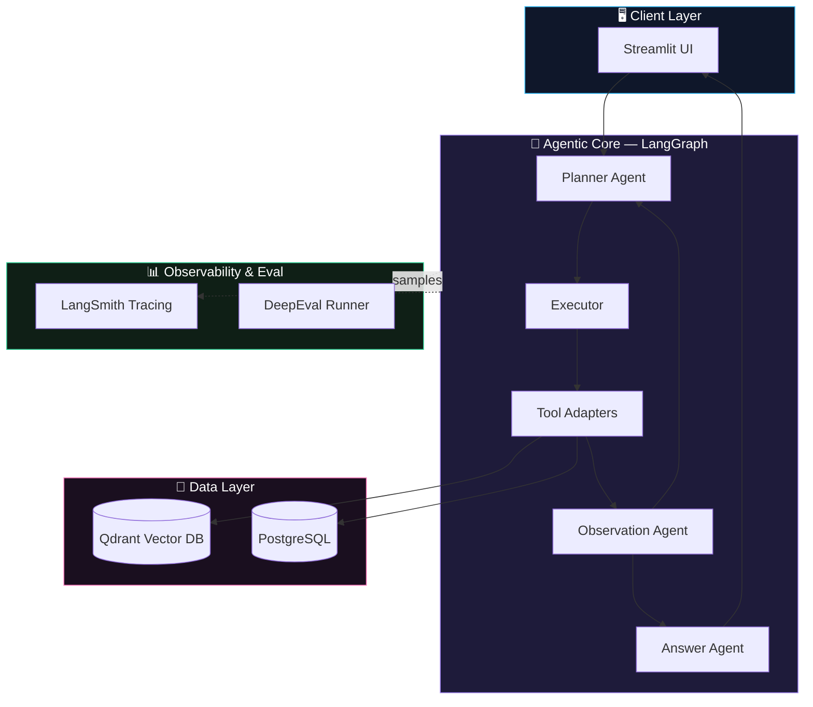
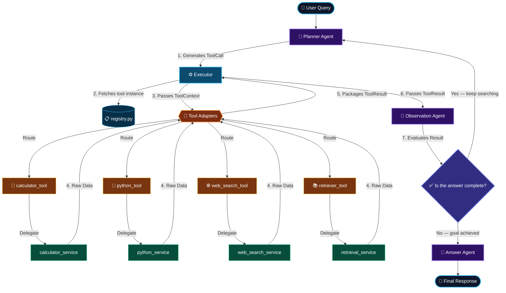
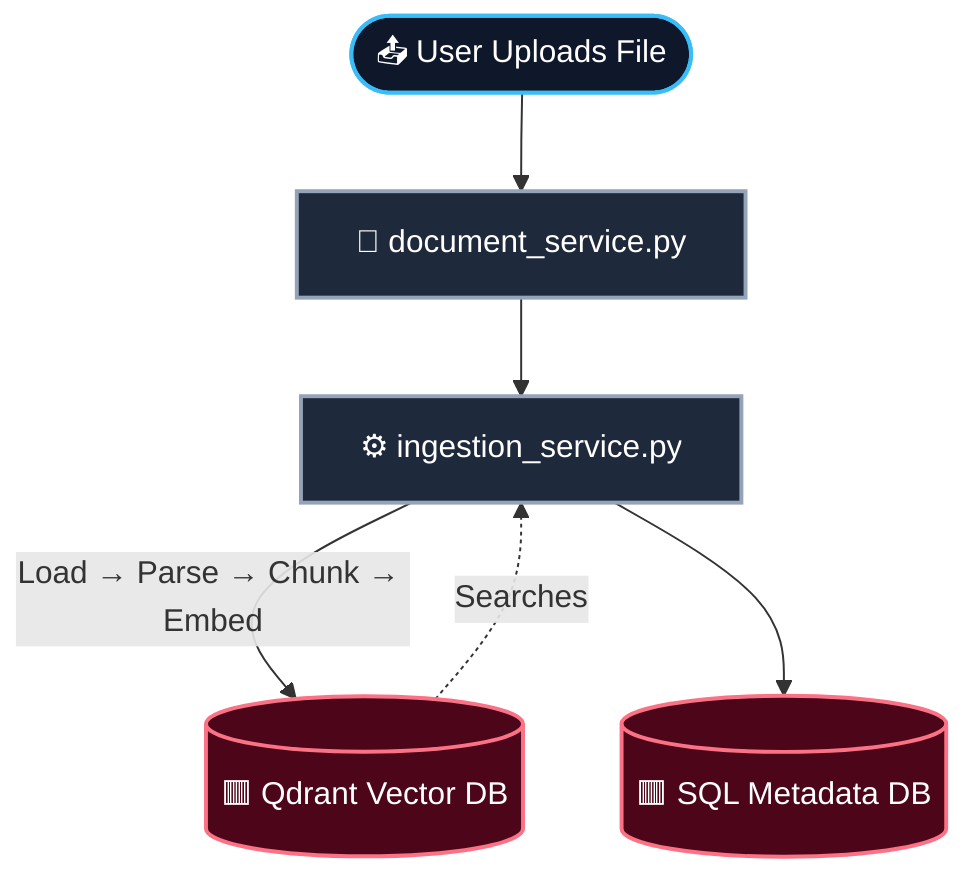
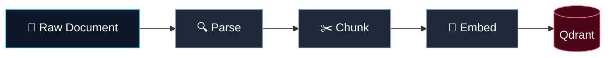
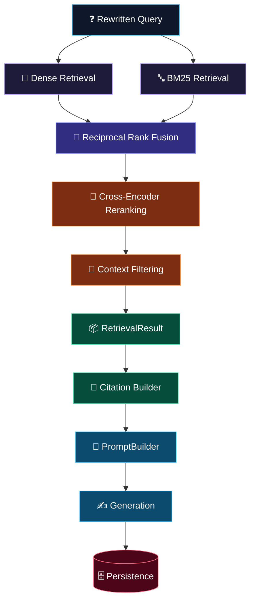
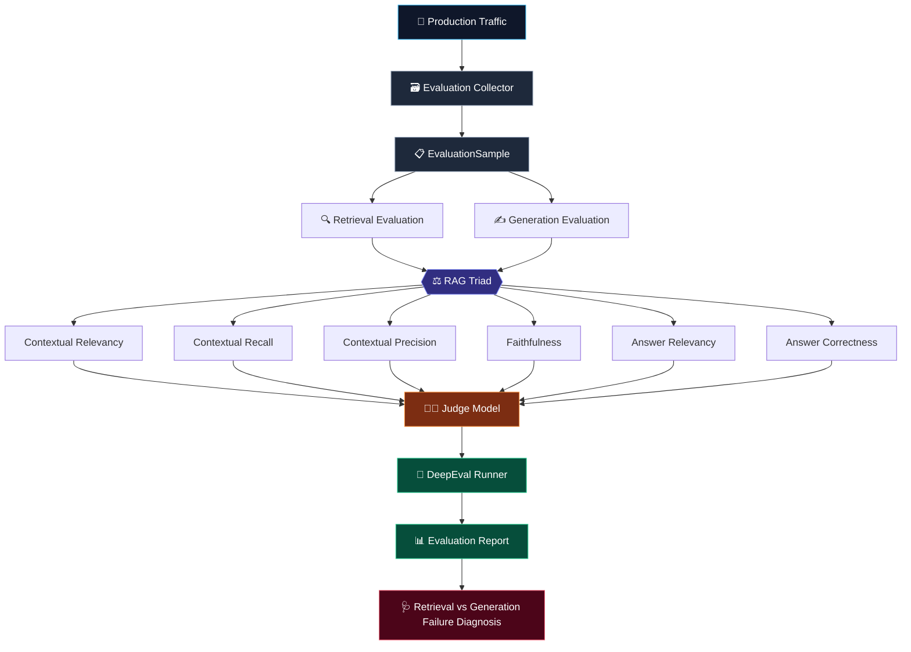

<div align="center">

# 🤖 Enterprise AI Assistant Chatbot

### AI Assistant with Hybrid RAG · Tool Calling · Reranking · Citations · Observability · DeepEval

<p>
  
  
  
  
</p>
<p>
  
  
  
  
  
</p>

<p><i>A production-grade agentic RAG system — plan, act, observe, cite, and evaluate.</i></p>

</div>

---

## 📌 Table of Contents

<table>
<tr>
<td valign="top" width="33%">

**Core**
- [Overview](#-overview)
- [Key Capabilities](#-key-capabilities)
- [System Architecture](#-system-architecture)
- [Technology Stack](#-technology-stack)

**Agent**
- [Agent Architecture](#-agent-architecture)
- [Main Agentic Chat Loop](#-main-agentic-chat-loop)
- [Router / Planner / Executor](#-router-planner--executor)
- [Observation & Agent Loop](#-observation--agent-loop)

</td>
<td valign="top" width="33%">

**Ingestion & RAG**
- [Document Ingestion](#-document-ingestion-pipeline)
- [Chunking & Embedding](#-chunking--embedding)
- [Qdrant Storage](#-qdrant-storage-workflow)
- [Complete RAG Pipeline](#-complete-rag-pipeline)
- [Hybrid Retrieval (Dense + BM25 + RRF)](#-hybrid-retrieval-workflow)
- [Cross-Encoder Reranking](#-cross-encoder-reranking)
- [Citation Builder](#-citation-builder-workflow)

</td>
<td valign="top" width="33%">

**Evaluation**
- [Evaluation Architecture](#-deepeval-evaluation-architecture)
- [RAG Triad Metrics](#-deepeval-rag-triad)
- [Failure Diagnosis](#-retrieval-vs-generation-failure-diagnosis)

**Operate**
- [Installation](#-installation)
- [Configuration](#-configuration)
- [Running the App](#-running-the-application)
- [Running Evaluation](#-running-evaluation)
- [Roadmap](#-roadmap)

</td>
</tr>
</table>

---

## 📖 Overview

The **Enterprise AI Assistant** is a production-oriented agentic AI system designed to answer user queries using enterprise knowledge, execute external tools when required, maintain conversational context, and generate grounded responses with citations.

```text
User Query → Agentic Reasoning → Retrieval / Tool Execution → Observation → Grounded Generation → Citations → Final Answer
```

The system combines stateful agent orchestration (**LangGraph**), LLM/tool abstractions (**LangChain**), dense + lexical + hybrid retrieval, reciprocal rank fusion, cross-encoder reranking, context filtering, conversation-aware query rewriting, thread-scoped document retrieval, citation generation, persistent conversations (**PostgreSQL**), vector storage (**Qdrant**), tracing (**LangSmith**), and evaluation (**DeepEval**).

---

## ✨ Key Capabilities

| Category | Capability |
|---|---|
| 🧠 **Agentic Reasoning** | Plan → Execute → Observe loop with iterative tool calling until the goal is achieved |
| 🔍 **Hybrid Retrieval** | Dense (semantic) + BM25 (lexical) fused via Reciprocal Rank Fusion |
| 🎯 **Reranking** | Cross-encoder reranking + context filtering for high-precision passages |
| 🛠️ **Tool Calling** | Calculator, Python execution, web search, and retriever tools routed dynamically |
| 📎 **Citations** | Every generated answer is grounded with traceable source citations |
| 💾 **Persistence** | Thread-scoped conversation history in PostgreSQL |
| 📊 **Observability** | Full run tracing via LangSmith |
| ✅ **Evaluation** | DeepEval RAG Triad — faithfulness, relevancy, recall, precision, correctness |

---

## 🏗️ System Architecture



---

## 🔁 Agent Architecture

### Main Agentic Chat Loop

> Mirrors the runtime graph: the **Planner** issues a tool call, the **Executor** dispatches it to the right adapter, results are **observed**, and the loop continues until the goal is achieved.



### Router · Planner · Executor

| Stage | Responsibility |
|---|---|
| **Router** | Classifies the incoming query and determines whether retrieval, a tool, or a direct answer is required |
| **Planner** | Decomposes the goal into a sequence of tool calls, one step at a time |
| **Executor** | Resolves the concrete tool instance from the registry and dispatches with full context |
| **Observation** | Evaluates whether the accumulated tool results satisfy the user's goal, looping back to the planner if not |

---

## 📥 Document Ingestion Pipeline



### Chunking & Embedding



---

## 🔀 Hybrid Retrieval Workflow



---

## ✅ DeepEval Evaluation Architecture



### DeepEval RAG Triad

| Metric | Measures |
|---|---|
| **Contextual Relevancy** | Are retrieved chunks relevant to the query? |
| **Contextual Recall** | Does retrieved context cover the expected answer? |
| **Contextual Precision** | Are the most relevant chunks ranked highest? |
| **Faithfulness** | Is the answer grounded in retrieved context (no hallucination)? |
| **Answer Relevancy** | Does the answer address the actual question? |
| **Answer Correctness** | Does the answer match the ground truth? |

---

## 🧰 Technology Stack

<div align="center">

| Layer | Technology |
|---|---|
| Orchestration | LangGraph |
| LLM Framework | LangChain |
| LLM Inference | Groq, Mistral AI |
| Vector Store | Qdrant |
| Relational Store | PostgreSQL |
| UI | Streamlit |
| Tracing | LangSmith |
| Evaluation | DeepEval |

</div>

---

# Project Structure

``` text
.
├── agents/
├── graph/
├── rag/
├── tools/
├── observability/
├── evals/
├── db/
├── frontend/
├── utils/
├── config.py
└── app.py
```

------------------------------------------------------------------------

# Installation

``` bash
git clone <repository-url>
cd enterprise-ai-assistant

python -m venv .venv

# Windows
.venv\Scripts\activate

pip install -r requirements.txt
```

Create a `.env` file:

``` env
GROQ_API_KEY=
MISTRAL_API_KEY=
TAVILY_API_KEY=
LANGSMITH_API_KEY=

LANGCHAIN_TRACING_V2=true
LANGCHAIN_PROJECT=Enterprise AI Assistant
```

Run:

``` bash
streamlit run app.py
```

------------------------------------------------------------------------

# Evaluation

``` bash
python -m evals.run --suite rag
```

Reports include:

-   Faithfulness
-   Answer Relevancy
-   Context Precision
-   Context Recall
-   Latency

------------------------------------------------------------------------

# Future Roadmap

-   Guardrails
-   Redis Caching
-   Celery Workers
-   Hybrid Search
-   Docker Deployment
-   CI/CD
-   Authentication & RBAC
-   Multi-format document ingestion

------------------------------------------------------------------------

# License

MIT License
